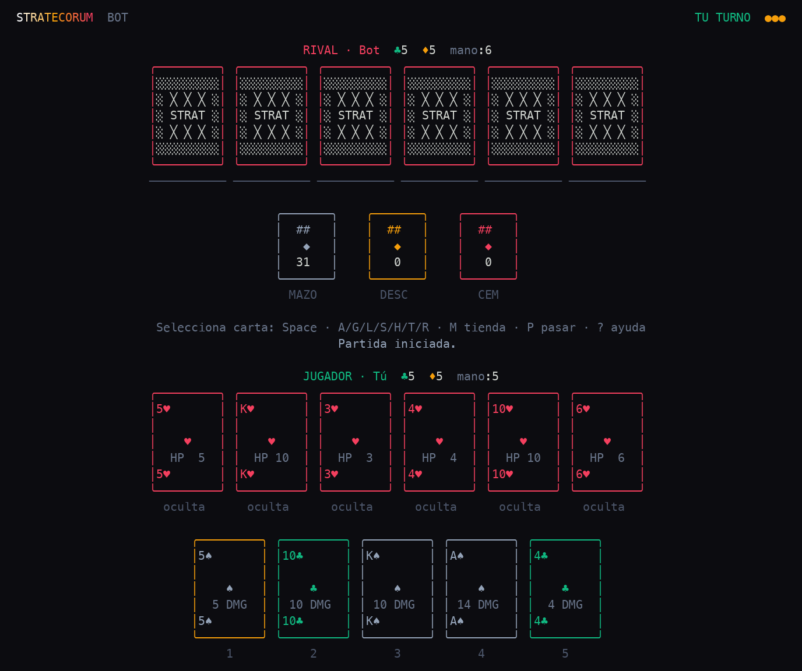

<div align="center">



# 🃏 Stratecorum Terminal

**Un juego de cartas y estrategia para la terminal, a todo color y sin dependencias externas.**


</div>

---

## Qué es esto

Stratecorum convertido en un juego de cartas y estrategia para la terminal, a todo color y sin dependencias externas. Gestiona tu mano, ataca al rival, defiéndete con escudos, tiende trampas, cúrate y aprovecha el Joker rojo. Pensado para iTerm con truecolor.

- 🃏 Juego de cartas estratégico con vidas, escudos, trampas, curaciones y el Joker rojo.
- 🛒 Tienda para gastar recursos durante la partida.
- 🤖 Dos modos de juego: **local pass-and-play** y **contra un bot** (con dificultad ajustable).
- 🎨 Interfaz a todo color (truecolor) optimizada para iTerm.
- 🪶 Cero dependencias externas: solo Python estándar.
- ✅ Incluye tests con `pytest`.

## 🎮 Cómo se juega

| Tecla | Acción |
| --- | --- |
| `1` / `2` | Elegir modo en el menú (bot / local) |
| `←` / `→` | Moverte por la mano, vidas o tienda |
| `Space` | Seleccionar / deseleccionar carta de la mano |
| `A` | Atacar |
| `G` | Guardar recursos |
| `L` | Colocar vida |
| `S` | Escudo |
| `H` | Curar |
| `T` | Trampa |
| `R` | Joker rojo / revivir |
| `M` | Tienda |
| `P` | Pasar turno |
| `Enter` | Confirmar objetivo |
| `C` | Confirmar ataque multiobjetivo |
| `Esc` | Cancelar modo actual |
| `Q` | Salir |

## 🚀 Cómo ejecutar

```bash
python3 play.py
```

O instalándolo como paquete:

```bash
pip install -e .
stratecorum-terminal
```

Ejecutar los tests:

```bash
pytest
```

> Recomendado: iTerm en una ventana de al menos `110x38`, fuente con símbolos Unicode y color truecolor.

## 🛠️ Bajo el capó

- **Python 3.11+**, solo librería estándar (cero dependencias externas).
- Render de terminal con truecolor propio (sin `curses`).
- Motor de juego, bot e interfaz separados en `src/stratecorum_terminal/` (`engine`, `bot`, `term`, `app`).
- Empaquetado con `pyproject.toml` y tests con **pytest**.

## 📦 Créditos

Hecho por [@gavilanbe](https://github.com/gavilanbe). Mi juego de estrategia por cartas dentro de la colección de juegos de terminal. 🕹️

## 📄 Licencia

[MIT](LICENSE)
